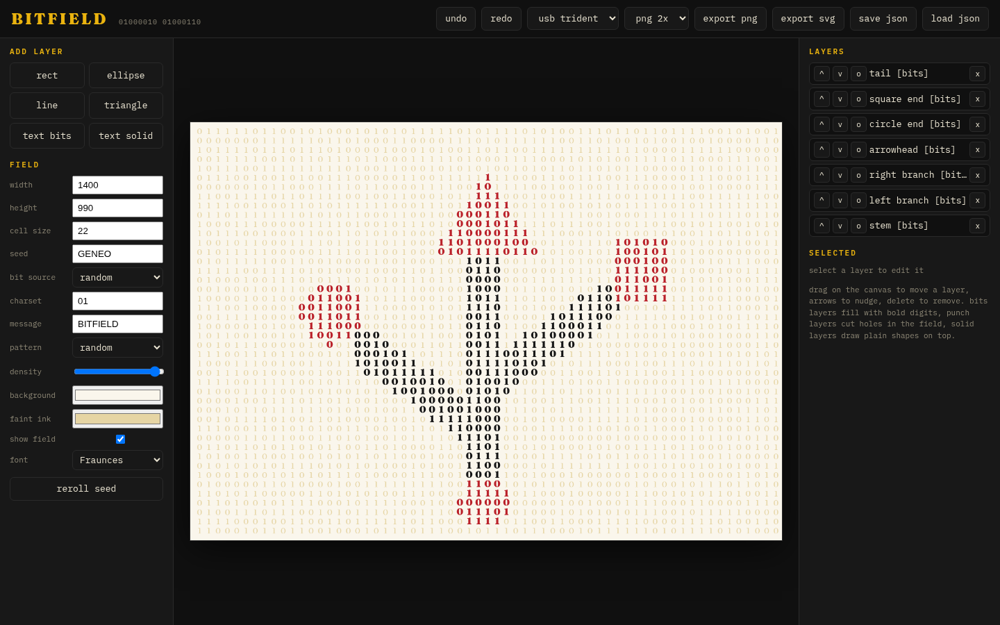

# BITFIELD

A binary field studio in the browser. Draw posters out of 1s and 0s: shapes
and text are rasterized into a seeded grid of digits, bold ink inside the
shapes, faint ink everywhere else. The technique comes from a printed A3 sign
where a USB trident was picked out of a field of binary.

Live at https://chuatzeyee.github.io/bitfield/



## What it does

- **Layers**: rectangles, ellipses, lines, triangles, and text, stacked in
  any order. Reorder, hide, rename, recolor, delete.
- **Three layer modes**:
  - `bits`: the shape is filled with bold digits in the layer color
  - `punch`: the shape cuts a hole in the field
  - `solid`: the shape is drawn plainly on top of the field
- **Field parameters**: canvas size, cell size, random seed, charset,
  density, background and faint ink colors, and the font.
- **Bit sources**: pure random, a threshold pattern, or a hidden message,
  where the field spells out your text in 8 bit ASCII, over and over.
- **Patterns**: gradients, waves, rings, vortex, checker, scanlines. They
  shape the density of the faint field, or drive the 0s and 1s directly.
- **Presets**: USB trident, heart, smiley, headline, blank.
- **Editing**: drag layers on the canvas, nudge with arrow keys, undo and
  redo with ctrl+z and ctrl+shift+z.
- **Export**: PNG at 1x to 4x, real vector SVG (each digit is a text glyph,
  editable afterward), and the whole document as JSON to save and load.

## Running locally

It is a static page with ES modules, so serve it over HTTP:

```
python3 -m http.server 8000
```

then open http://localhost:8000/. No build step, no dependencies. Fonts
(Fraunces and IBM Plex Mono) load from Google Fonts.

## Layout

```
index.html      page shell
style.css       dark UI theme
js/engine.js    seeded RNG, patterns, mask rasterizer, canvas renderer
js/app.js       state, undo, panels, canvas interaction
js/export.js    PNG, SVG, and JSON export
js/presets.js   starting documents
```

## License

MIT. Fonts are served from Google Fonts under the SIL Open Font License.
